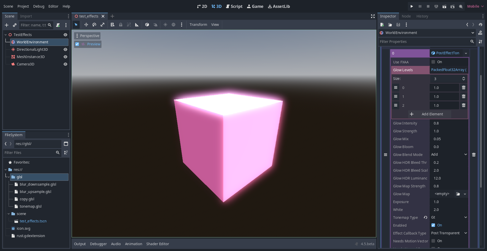

Glow + ToneMap CompositorEffect for Godot.

Most of the code is adapted from Godot source code. The Glow is adapted from https://github.com/godotengine/godot/pull/110077. The lottes tonemapper and gt (uchimura) tonemapper are from https://gist.github.com/Pikachuxxxx/136940d6d0d64074aba51246f514bd26.
